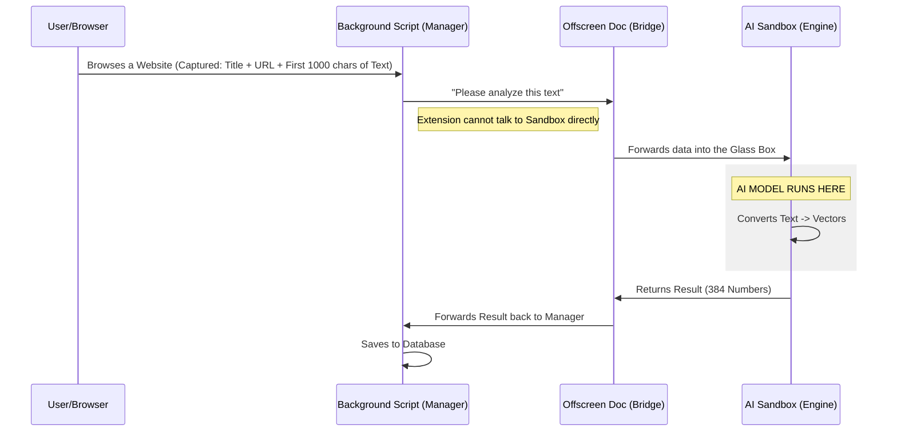

# The "Sandboxed Offscreen" Architecture

## High-Level Summary
This architecture is a clever workaround to run powerful AI models (like Transformers) inside a Chrome Extension without:
1.  **Freezing the Browser** (Solved by "Offscreen").
2.  **Violating Security Rules** (Solved by "Sandbox").

---

## 1. The Components

### A. The "Offscreen" Document (The Runner)
*   **What is it?** A hidden HTML page created by the extension that the user never sees.
*   **Why use it?** 
    *   Chrome Extensions normally run as "Service Workers," which fall asleep when inactive and cannot handle long-running tasks.
    *   The Offscreen Document stays alive as long as we need it to process heavy data.
    *   **Analogy**: It's like hiring a background assistant to crunch numbers while you work on the main screen.

### B. The "Sandbox" (The Safe Zone)
*   **What is it?** An isolated iframe with relaxed security rules.
*   **Why use it?**
    *   Modern AI libraries (like `Transformers.js`) use advanced code techniques (WebAssembly, dynamic evaluation) that Chrome's strict security (Manifest V3) blocks in normal extensions.
    *   The Sandbox allows this code to run because it is **network isolated** and has **no access** to the user's cookies, passwords, or direct browsing history.
    *   **Analogy**: It's a "Lab" inside a glass box. Dangerous experiments (complex code) can happen inside, but nothing can leak out to hurt the main building.

---

## 2. How They Work Together

We place the **Sandbox** (the Lab) *inside* the **Offscreen Document** (the Assistant).

### Data Flow Diagram



## 3. Key Talking Points for Presentation

1.  **Privacy First**: "Because the AI runs in a sandbox inside the browser, no data ever leaves the user's text. It is 100% private."
2.  **Zero Server Cost**: "By using the user's own device to calculate embeddings, we eliminate the need for expensive GPU servers."
3.  **Innovative Bypass**: "We creatively combined Chrome's *Offscreen API* and *Sandbox API* to bring Server-Grade AI capabilities into a client-side extension."

---

## 4. The AI Tech Stack Explained

### A. The AI Model: `all-MiniLM-L6-v2`
*   **Name**: `Xenova/all-MiniLM-L6-v2`
*   **What is it?** It is a **Sentence Transformer** model designed by Microsoft and converted for the web by Hugging Face.
*   **Why this one?**
    *   **Tiny Size**: Only ~22MB (smaller than many high-res images).
    *   **High Speed**: Optimized to run on consumer laptops in milliseconds.
    *   **Purpose**: It is specifically trained to map sentences & paragraphs to a 384-dimensional dense vector space for semantic search tasks.

### B. The Library: `Transformers.js`
*   **What is it?** A JavaScript library created by **Hugging Face**.
*   **The Magic**: It normally takes Python and massive servers to run these models. Transformers.js acts as a translator, allowing these models to run **natively inside the web browser** (using ONNX Runtime and WebAssembly).
*   **Impact**: This is what makes "Serverless AI" possible. The browser *becomes* the server.

### C. The "384-Dimensional Vector"
*   **Technical Definition**: A list (array) of 384 floating-point numbers (e.g., `[0.12, -0.98, 0.05, ...]`).
*   **The Analogy (For your Audience)**:
    *   **GPS Coordinates**: To find a coffee shop, you need **2 numbers** (Latitude, Longitude).
    *   **Space**: To find a satellite, you might need **3 numbers** (Lat, Long, Altitude).
    *   **Meaning**: To pinpoint the exact *meaning* of a sentence—distinguishing "Apple" (the fruit) from "Apple" (the company)—2 or 3 numbers aren't enough. This AI uses a "Meaning Map" that has **384 dimensions**.
    *   **Result**: Every sentence gets a unique "coordinate" in this 384-dimensional space. Sentences with similar meanings (like "Hello" and "Hi") land very close to each other on this map.

---

## 5. The Math: How We Compare

### A. "One Vector to Rule Them All" (Pooling)
You asked: *"Is the vector saved for all 1000 characters?"*
*   **Yes, but as a summary.**
*   The AI reads the Title + URL + 1000 chars.
*   It performs a process called **Mean Pooling**. It takes the meaning of every word and averages them into **ONE single 384-dimensional vector** that represents the *entire concept* of that text block.
*   **Analogy**: It's like taking a whole book and summarizing it into a single "Genre" tag (but much more precise).

### B. The Comparison (Cosine Similarity)
When you search, we compare the **Query Vector** (your question) vs. the **Page Vector** (history).
*   **The Math**: We calculate the **Cosine Similarity**.
    *   This measures the **angle** between the two vectors in that 384-dimensional space.
*   **The Score**:
    *   **1.0**: Perfect match (Identical meaning).
    *   **0.0**: No relation.
    *   **-1.0**: Opposite meaning.
*   **Why it works**: "Game" and "Play" point in the same direction in vector space, so the angle is small, and the score is high. "Game" and "Banana" point in different directions, so the score is low.

---

## 6. Performance Comparison (Normal vs. ReMind)

### A. Process Overhead
*   **Normal Chrome**: 1 Process per Tab + 1 Browser Process + 1 GPU Process.
*   **With ReMind**: Adds **+2 Lightweight Processes**:
    1.  **Service Worker**: The extension manager (Standard, ~15MB RAM).
    2.  **Offscreen Document**: The AI host (Active during indexing/searching, ~100-150MB RAM).

### B. Memory (RAM) Usage
*   **Model Size**: The AI Model (`MiniLM`) is highly optimized and compressed (Quantized) to only **~22 MB**.
*   **Runtime**: When loaded in memory with the ONNX runtime, the total impact is roughly **150 MB**.
*   **Vector Storage**: Negligible. 1,000 visited pages take up only **~1.5 MB** of storage.
*   **Impact**: On a modern laptop (8GB+ RAM), this is less than the cost of opening **one extra Facebook tab**.

### C. Processing Power (CPU/GPU)
*   **Browsing**: Zero continuous load. CPU only spikes for **100-300ms** when you finish loading a page (to index it).
*   **Searching**: The comparison math (Cosine Similarity against 1000s of pages) takes **< 50 milliseconds** on a standard CPU.
*   **GPU**: Not strictly required. We use WebAssembly (WASM), allowing it to run efficiently on the CPU even if no dedicated GPU is present.

### D. System Requirements
To run ReMind smoothly, we recommend:
*   **RAM**: 8GB (Standard). 4GB will work but might be tight with many tabs.
*   **CPU**: Any processor from 2018 or later (Intel i3/i5, AMD Ryzen, or Apple M-Series).
*   **GPU**: Integrated Graphics is sufficient.

---

## 7. The Code: Cosine Similarity

Here is the actual Javascript algorithm we use to compare the 384-dimensional vectors. You can show this in your slides to demonstrate the "math" behind the magic.

```javascript
/**
 * Calculate Cosine Similarity between two vectors
 * @param {Array<number>} vecA - The Query Vector
 * @param {Array<number>} vecB - The Page Vector
 * @returns {number} Score from -1.0 to 1.0
 */
cosineSimilarity(vecA, vecB) {
    if (!vecA || !vecB || vecA.length !== vecB.length) return 0;

    let dot = 0;
    let normA = 0;
    let normB = 0;

    // Iterate through all 384 dimensions
    for (let i = 0; i < vecA.length; i++) {
        dot += vecA[i] * vecB[i];      // A . B
        normA += vecA[i] * vecA[i];    // |A|^2
        normB += vecB[i] * vecB[i];    // |B|^2
    }

    if (normA === 0 || normB === 0) return 0;
    
    // Formula: (A . B) / (|A| * |B|)
    return dot / (Math.sqrt(normA) * Math.sqrt(normB));
}
```

---

## 8. ZenPet Persistence (chrome.storage.local)
ZenPet uses the `chrome.storage.local` API for high-frequency state updates like coin balances, pet health, and pomodoro timers.

| Key | Schema | Purpose | Persistence |
| :--- | :--- | :--- | :--- |
| **`zenpet_user`** | `{ coins, ownedRooms }` | User economy & unlocks | Permanent |
| **`zenpet_pet`** | `{ state, name, happiness, hunger, lastFed, lastPetted, experience, room, lastUpdated }` | Virtual Pet health & evolution | Permanent |
| **`zenpet_pomodoro`** | `{ state, focusDuration, breakDuration, timeRemaining, isRunning }` | Active focus session state | Session-persistent |
| **`zenpet_tasks`** | `Array<{ id, title, completed, createdAt }>` | User Todo list | Permanent |

---

## 9. Data Schema & Storage Costs (IndexedDB)

What exactly are we saving? Here is the breakdown of a single "Memory" entry.

| Field | Type | Description | Size (Approx) |
| :--- | :--- | :--- | :--- |
| **`id`** | Integer | Unique ID | 8 Bytes |
| **`url`** | String | The page link | ~100 Bytes |
| **`title`** | String | Page Title | ~100 Bytes |
| **`timestamp`** | Integer | Time visited | 8 Bytes |
| **`domText`** | String | First 1000 characters of visible text | ~2 KB |
| **`embedding`** | Array | The 384-dimensional vector (Float32) | 1.5 KB |
| **`screenshot`** | String | Base64 Data URL (Low Res) | ~150-300 KB |
| **TOTAL** | | **Space per Page** | **~200 KB** |

### Capacity Estimates
*   **1,000 Pages**: ~200 MB
*   **10,000 Pages**: ~2 GB (Old screenshots are auto-deleted after 7 days)

*Note: Browsers typically allow 50-80% of disk space for IndexedDB, so you can store millions of pages without hitting limits.*
*   **100,000 Pages**: ~400 MB

*Note: Browsers typically allow 50-80% of disk space for IndexedDB, so you can store millions of pages without hitting limits.*


